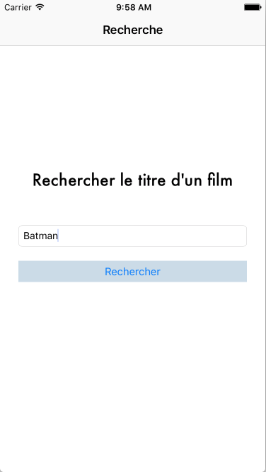
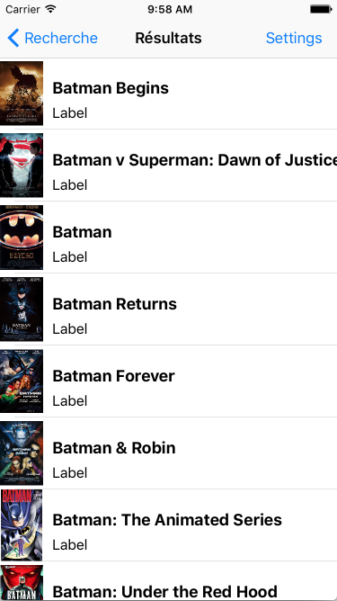

# SwiftApiFilms
Recherche de films à partir d'un mot.

## Fonctionnalités
- Champ de recherche du film

## Utilisation
1. Saisir un nom de film ou un mot contenu dans un titre de film dans le premier champ de recherche
2. L'application renvoi la liste des films en rapport avec la recherche
3. En sélectionnant un film, l'application montre le détail du film (synopsis, acteurs, réalisateur, note, ...) 

## Développement
Ouvrir le fichier **cocoatest.xcworkspace** dans XCode pour éditer les sources

## About
- TP Swift3 (MASTER 1 - Développeur Full-Stack)
- Swift3, iOS, XCode
- Pods Alamofire
- API Films : http://www.omdbapi.com/
- © **Dimitri Sandron** - _Mai 2017_

### Restants à faire
- Page de détail d'un film
- Paramétrage (nombre de résultats, ...)

#### Améliorations possibles
- Ajout d'un système de favoris